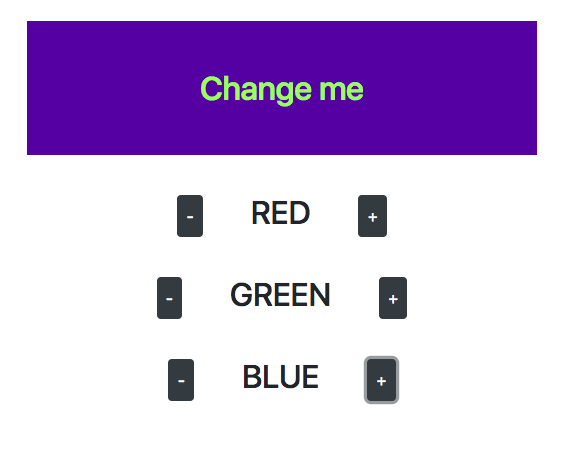

# React Colour Changer

A React app in which the colour of a box can be changed by clicking buttons to add or subtract the R, G, and B values by amounts of 10. The colour of the text in the box is also changed, and is always the inverse of the box's colour.

Created as an exercise in getting familiar with React :)

